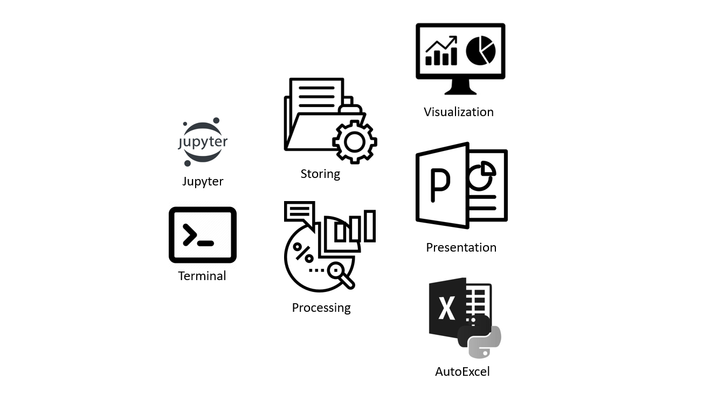

Этот репозиторий представляет собой сборник заготовок, лайфхаков и практик, которые я использую в своей работе при анализе данных.

# Структура 

## SQL

- [**Concepts.ipynb**](https://github.com/Saxsafon/Analysis/blob/master/SQL/Concepts.ipynb) - описание базовых концепций языка PostgreSQL с примерами.

- [**Groupby.ipynb**](https://github.com/Saxsafon/Analysis/blob/master/SQL/Groupby.ipynb) - набор практик по группировке данных с помощью оператора group by.

- [**Pivot_Tables.ipynb**](https://github.com/Saxsafon/Analysis/blob/master/SQL/Pivot_Tables.ipynb) - способы формирования сводных таблиц с помощью PostgreSQL.

- [**Joins.ipynb**](https://github.com/Saxsafon/Analysis/blob/master/SQL/Joins.ipynb) - описание различных способов объедиинения таблиц, и практики использования оператора join.

- [**Union.ipynb**](https://github.com/Saxsafon/Analysis/blob/master/SQL/Union.ipynb) - практики использования операторов Union и Union All
    - Конкатенация таблиц
    - Посчитать количество связей в обоих направлениях
    
- [**Window_functions.ipynb**](https://github.com/Saxsafon/Analysis/blob/master/SQL/Window_functions.ipynb) - реализация оконных функций в PostgreSQL, а также множество способов их применения.
    - Посчитать процентное изменение
    - Посчитать отклонение от среднего
    - Отранжировать значения
    - Отранжировать агрегаты
    - Получить процентный ранг значения (в контексте групп)
    - Выделить первое, последнее или n-ное значение
    - Вывести предыдущую, текущую и следующую строки в контексте группы
    - Посчитать скользящее среднее

- [**Rounds.ipynb**](https://github.com/Saxsafon/Analysis/blob/master/SQL/Rounds.ipynb) -  варианты округления значений с примерами и описанием различных нюансов (Work in Progress).

- [**Strings_processing.ipynb**](https://github.com/Saxsafon/Analysis/blob/master/SQL/Strings_processing.ipynb) - практики работы со строками с помощью PostgreSQL.
    - Выделить подстроку
    - Определе определить вхождение строк
    - Конкатенация нескольких строковых колонок в одну
    - Конкатенация сгруппированных значений в строку
    - Разделение строки по указанному символу
    
- [**Datetime_processing.ipynb**](https://github.com/Saxsafon/Analysis/blob/master/SQL/Datetime_porcessing.ipynb) - набор практик работы с типом данных datetime.

- [**Math_operations**](https://github.com/Saxsafon/Analysis/blob/master/SQL/Math_operations.ipynb) - готовые конструкции для выполнения комплексных математических операций с помощью PostgreSQL.
    - Посчитать среднеквадратичесую ошибку прогноза
    - Посчитать растояние между двумя точками
    
- [**Interview_tasks.ipynb**](https://github.com/Saxsafon/Analysis/tree/master/SQL) - разбор реальных задач, которые попадались мне на SQL-собеседованиях.

### PostgreSQL - взаимодействие с базой из jupyter-ноутбука
- [**PostgreSQL.ipynb**](https://github.com/Saxsafon/Analysis/blob/master/SQL/PostgreSQL/PostgreSQL.ipynb) - в ноутбуке реализован класс, с помощью которого можно обращаться к БД из jupyter-ноутбука.
    - Посмотреть схему таблиц в БД
    - Создать таблицу
    - Добавить запись в таблицу
    - Получить данные из таблицы
    - Изменить таблицу
    - Удалить записи из таблицы
    - Удалить таблицу

- [**Update.ipynb**](https://github.com/Saxsafon/Analysis/blob/master/SQL/PostgreSQL/Update.ipynb) - приведены кейсы по обновлению данных в БД.
    - Упаковка значений колонко в json-формат
    - Заменить конкретные значения колонки на строковый 'null'
    - Добавить новую колонку
    - Переименовать колонку
    - Удалить колонку

## Python

### Jupyter - приемы работы в Jupyter notebooks.
- [**Start.ipynb**](https://github.com/Saxsafon/Analysis/blob/master/Python/Jupyter/Start.ipynb) - илюстрированная инструкция по установке и настройке рабочего окружения.
  - Как добавить python в список системных переменных?
  - Как создать рабочую среду Python?
  - Как установить Jupyter и другие пакеты?
  - Как запустить Jupyter, в том числе через ярлык на рабочем столе?

- [**Jupyter_IPython.ipynb**](https://github.com/Saxsafon/Analysis/blob/master/Python/Jupyter/Jupyter_IPython.ipynb) - возможности оболочки IPython
  - Магические команды (как импортировать ноутбук?)
  - Доступ к документации
  - Автозаполнение

- [**external_code_example.ipynb**](https://github.com/Saxsafon/Analysis/blob/master/Python/Jupyter/external_code_example.ipynb) - код в этом ноудбуке импортируется в файл Jupyter_IPython.ipynb

- [**Jupyter_settings**](https://github.com/Saxsafon/Analysis/blob/master/Python/Jupyter/Jupyter_settings.ipynb) - конструкции, позволяющие настроить ноутбук для более удобной работы. 
  - Как изменить количество символов, выводимых в ячейках датафреймов?
  - Как изменить ширину ячеек ноутбука?
  - Как скрыть предупреждения?

- [**Jupyter_lifehacks.ipynb**](https://github.com/Saxsafon/Analysis/blob/master/Python/Jupyter/Jupyter_lifehacks.ipynb) - здесь содержатся дополнительные лайфхаки и практики, полезные при работе в ноутбуках
  - Как вывести датафреймы рядом друг с другом?
  - Как сохранить ноутбук изнутри ячейки?
  
- [**Markdown**](https://github.com/Saxsafon/Analysis/blob/master/Python/Jupyter/Markdown.ipynb) - показаны возможности облегченного языка разметки Markdown. Он очень полезен при оформалении и документации ноутбуков (а также в написании README к репозиториям на гитхабе).
  -  Заголовки, выделения текстов, ссылки
  -  Вставка таблиц, изображений и кусков кода
  -  LaTeX - написание математических выражений
 
- [**Shortcuts.ipynb**](https://github.com/Saxsafon/Analysis/blob/master/Python/Jupyter/Shortcuts.ipynb) - комбинации клавиш для работы с Jupyter Notebook.
    - Запуск работы ячеек
    - Создание и удаление ячеек
    - Навигация внутри ноутбука

### Storing

- [**Archives.ipynb**](https://github.com/Saxsafon/Analysis/blob/master/Python/Storing/Archives.ipynb) - здесь собраны python-пакеты для работы с .7z и .zip архивами (py7zr, zipfile, shutil)
  - Как распаковать архивы различных форматов?
  - Как упоковать один или несколько файлов в архив?

- [**Files.ipynb**](https://github.com/Saxsafon/Analysis/blob/master/Python/Storing/Files.ipynb) - файл содержит несколько функций, с помощью которых можно считать содержимое сразу нескольких файлов

- [**Formats.ipynb**](https://github.com/Saxsafon/Analysis/blob/master/Python/Storing/Formats.ipynb) - здесь перечислены различные форматы для хранения данных, продемонстрированы их преимущества и недостатки
  - .xlsx - удобный для просмотра глазами, но объемный и долго считывается
  - .csv - распространенный формат, который можно очень хорошо сжать архиватором. Но в обычном состоянии объемный и тоже долго считывается.
  - .feather - не открывается. Зато занимает мало места и очень быстро считывается.

- [**Pickle.ipynb**](https://github.com/Saxsafon/Analysis/blob/master/Python/Storing/Pickle.ipynb) - примеры сохранения объектов python в .pkl-файлах с помощью пакета Pickle

- [**JSON.ipynb**](https://github.com/Saxsafon/Analysis/blob/master/Python/Storing/JSON.ipynb) - приемы работы с данными, представленными в формате JSON.
    - Рекурсивный парсинг json-ов
    
- [**BigQuery.ipynb**](https://github.com/Saxsafon/Analysis/blob/master/Python/Storing/BigQuery.ipynb) - приемы работы с облачным хранилищем Google BigQuery с помощью Python.
    - Настройка подключения
    - Оценить объем возвращаемых данных без запуска запроса
    
- [**HDFS.ipynb**](https://github.com/Saxsafon/Analysis/blob/master/Python/Storing/HDFS.ipynb) - практики работы с кластерным хранилищем HDFS с помощью Python.
    - Подключение к HDFS
    - Загрузка данных из HDFS
    - Декодировка данных в формате bytes
    
### Generation
При разработке обрабатывающих pipeline-ов, бывает полезно сгенерить тестовые данные.

- [**Custom_fuctions.ipynb**](https://github.com/Saxsafon/Analysis/blob/master/Python/Generation/Custom_fuctions.ipynb) - практики и примеры генерации данных различного вида.
  - Как сгенерить данные с внутренними зависимостями _(пока в разработке)_
  
- [**Random.ipynb**](https://github.com/Saxsafon/Analysis/blob/master/Python/Generation/Random.ipynb) - примеры функционала пакета random, а также numpy-рандомайзера

### Processing

- [**Groupby.ipynb**](https://github.com/Saxsafon/Analysis/blob/master/Python/Processing/Groupby.ipynb) - набор практик использования метода .groupby() 
  - .groupby() + .apply()
  - .groupby() + .agg()
  - .groupby() + .filter()
  - .groupby() + .transform()
  - Как посчитать и вывести сумму элементов на каждом уровне группировки?

- [**Pivot_tables.ipynb**](https://github.com/Saxsafon/Analysis/blob/master/Python/Processing/Pivot_tables.ipynb) - здесь собраны практики использования метода .pivot_table() (ОЧЕНЬ полезная штука)
  - Методы .pivot() и .pivot_table(), чем они отличаются?
  - Многомерная сводная таблица
  - Вычисление суммы по колонок и строк
  - Кастомные бины и автоматические квантили
  - Как посчитать значения за определенный временной период?
  - Heatmap в сводных таблицах

- [**Manipulation.ipynb**](https://github.com/Saxsafon/Analysis/blob/master/Python/Processing/Manipulation.ipynb) - методы и практики для работы с данными 
  - value_counts() - количественное и процентное соотношение + бины, в том числе и кастомные
  - Маски, их сохранение и комбинирование
  - Как из одной категориальной колоки сделать несколько one-hot колонок, и как сделать обратную операцию?
  - Векторизованные операции над строками
  - ReGex и методы, использующие регулярные выражения

- [**Datetime.ipynb**](https://github.com/Saxsafon/Analysis/blob/master/Python/Processing/Datetime.ipynb) - ноутбук содержит практики работы с пакетом datetime
  - Объекты date, time и datetime
  - Перевод datetime-объектов в строки и наоборот
  - Объекты timestamp и timedelta
  - Как быстро посчитать количество секунд между записями в таблице?
  - Как посчитать количество записей за временной период? _(здесь используются pivot_table)_

- [**Lifehacks.ipynb**](https://github.com/Saxsafon/Analysis/blob/master/Python/Processing/Lifehacks.ipynb) - здесь хранятся дополнительные небольшие лайфхаки. А также практики требующие разбора.
  - Как добавить несколько колонок с помощью одной функции?
  - Как заменить или сбросить header датафрейма?
  - Как вывести датафрейм в виде строки, чтобы его было удобно читать?
  
- [**Compare.ipynb**](https://github.com/Saxsafon/Analysis/blob/master/Python/Processing/Compare.ipynb)

- [**EDA.ipynb**](https://github.com/Saxsafon/Analysis/blob/master/Python/Processing/EDA.ipynb)

- [**Joins.ipynb**](https://github.com/Saxsafon/Analysis/blob/master/Python/Processing/Joins.ipynb)

- [**Multiindex.ipynb**](https://github.com/Saxsafon/Analysis/blob/master/Python/Processing/Multiindex.ipynb)

- [**ML.ipynb**](https://github.com/Saxsafon/Analysis/blob/master/Python/Processing/ML.ipynb)

- [**Packing.ipynb**](https://github.com/Saxsafon/Analysis/blob/master/Python/Processing/Packing.ipynb)

- [**Window_functions.ipynb**](https://github.com/Saxsafon/Analysis/blob/master/Python/Processing/Window_functions.ipynb)
  
### Visualization

- [**Matplotlib.ipynb**](https://github.com/Saxsafon/Analysis/blob/master/Visualizing/Matplotlib.ipynb) - приемы построения графиков средствами пакета matplotlib
  - Встроенные методы Pandas - самый быстрый способ визуализировать данные 

- [**Plotly.ipynb**](https://github.com/Saxsafon/Analysis/blob/master/Visualizing/Plotly.ipynb) - приемы построения различных графиков средствами пакета plotly
  - Столбчатый (в том числе горизонтальный), линейный, круговой графики
  - Управление подписями к графикам
  - Скользящее среднее
  - Визуализация деревьев _(пока в разработке)_

- [**Table.ipynb**](https://github.com/Saxsafon/Analysis/blob/master/Visualizing/Tables.ipynb) - здесь подробно разобраны возможности стилизации датафреммов с помощью атрибута .style. А также работа с объектами Styler
  - Как выделить границы датафрейма?
  - Как добавить несеколько heatmap-градиентов в одну таблицу?

### AutoExcel
Пакет OpenPyxl используется для настройки файлов excel с помощью Python. С его помощью можно представлять результаты анализа в виде красивых автоматических excel-отчетов.

 - [**Openpyxl_offloading.ipynb**](https://github.com/Saxsafon/Analysis/tree/master/AutoExcel) - в этом ноутбуке собраны практики выгрузки датафреймов файл excel. А также дополнительной настройки этих файлов.
  - Как автоматически масштабировать ширину колонок, в соответствии с их содержанием?
  - Как выгрузить данные с многоуровневой шапкой таблицы?
  - Как добавить фильтры в excel-файлы?
  - Как сгруппировать строки или колонки в excel-файлах? 

### 7. Presentation
- [**Presentation Builder.pptx**](https://github.com/Saxsafon/Analysis/blob/master/Presentation/Presentation%20Builder.pptx) - в этом файле собрана коллекция фигур и изображений, с помощью которыз можно легко и быстро собрать схему или макет идеи.

## Terminal
- [**Linux.md**](https://github.com/Saxsafon/Analysis/blob/master/Terminal/Linux.md) - команды для работы в Linux-терминале.
    - Навигация в терминале
    - Движение по каталогу
    - Работа с Jupyter Notebook
    - Перенос файла на удаленный сервер

- [**Anaconda.md**](https://github.com/Saxsafon/Analysis/blob/master/Terminal/Anaconda.md) - команды для работы в терминале Anaconda.
    - Создание виртуальных окружений
    - Установка пакетов

- [**Git.md**](https://github.com/Saxsafon/Analysis/blob/master/Terminal/Git.md) - команды для работы с системой контроля версий Git.
    - Инициализация Git
    - Работа с commit-ами
    - Управление ветками проекта
    - Обновление репозитория (Pull / Push)

   
- [**os.ipynb**](https://github.com/Saxsafon/Analysis/blob/master/Terminal/os.ipynb) - в этом ноутбуке собраны функции и методы пакета os, используемые для взаимодействия с командной строкой

